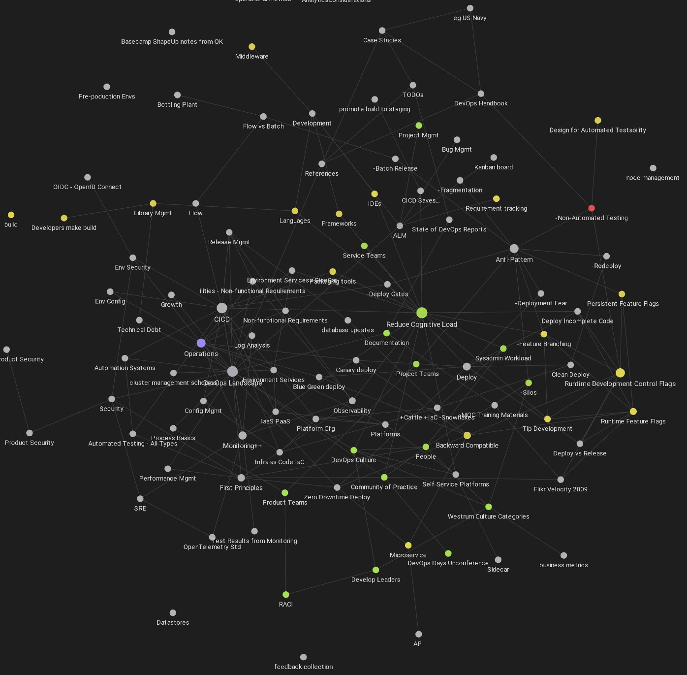

### Introduction
This repo contains an Obsidian Vault that generates an associative graph of DevOps concepts. 
### DevOps Mind Map
The image below is generated by Obsidian from a source tree of .md files. Look below for Obsidian setup instructions.

Currently this is the work of a single autho. I came to DevOps as a developer so the map is current biased toward development concerns. Like so much of DevOps collaboration is needed to bring other domains into focus.

### Obsidian System Setup
You need to install Obsidian to use this repo. Obsidian is a markdown based, wiki-like documentation system. 

- Obsidian Documentation
	- Download and Install
		- https://help.obsidian.md/Getting+started/Download+and+install+Obsidian
	- Support Forum: https://forum.obsidian.md/
	- Help pages: https://help.obsidian.md/Obsidian/Obsidian
	- A useful collection of How To videos for Obsidian 
		- https://www.youtube.com/watch?v=QgbLb6QCK88&t=2s&ab_channel=LinkingYourThinking

### Todos
- Add how-to for non-developers
	- Download the ZIP file via CODE button dropdown
- Add a standalone introduction that does not require installing Obsidian. Include screenshots and videos of the Map showing what you'll be able to see and do if you install Obsidian.

